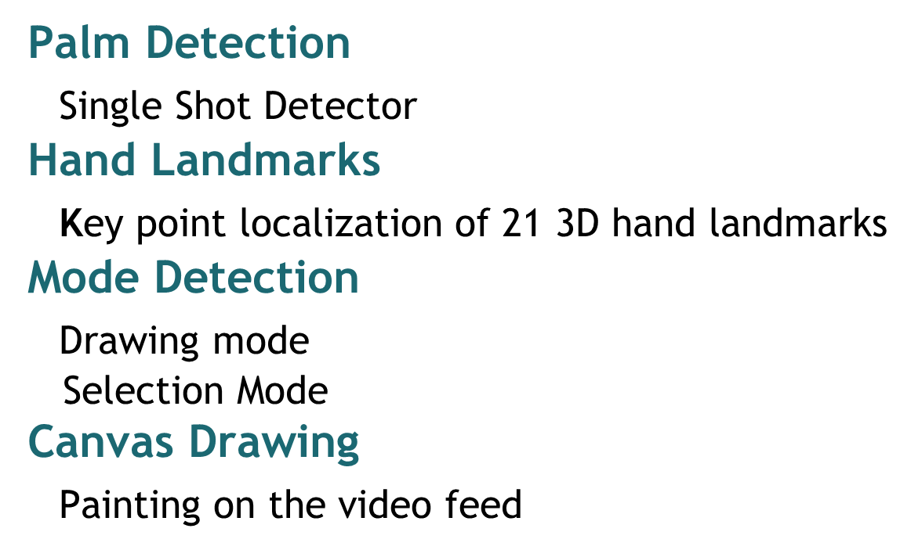

# **Virtual Sketcher**

This is a computer vision project which detects hands and palm landmarks in real time and uses the data to create a painter application.

##What is done here

###Libraries Used
_OpenCV2_

_Mediapipe_

_Numpy_